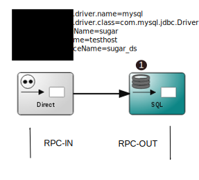

:linkattrs:
:source-highlighter: rouge

=== icon:play[size=1x,role=black] Processingsteps ===

==== Serverside ====
--
[role=border]

--
<1> The databasequery

{empty} +

==== Clientside(representation) ====

[source,html]
----
<template is="dom-bind">
  <simpl-panel bgcolor="black">
    <simpl-rpc params="{namespace:'cassandra'}" method="sql" service="camelRoute" response="{{response}}"></simpl-rpc><!--1-->
    <simpl-datatables options='{paging: true,"bFilter":false,"dom":"frtiS",scrollY:"150px"}' data="{{response}}" /><!--2-->
  </simpl-panel>
</template>
----

<1> Execute the sql-query
<2> Data representation with datatable.
