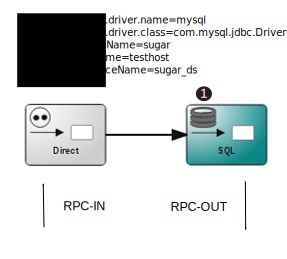

:linkattrs:
:source-highlighter: rouge

=== icon:play[size=1x,role=black] Verarbeitungschritte ===

==== Serverseitig ====
--
[role=border]

--
<1> Die Datenbankabfrage

{empty} +

==== Clientseitig(Darstellung) ====

[source,html]
----
<template is="dom-bind">
  <simpl-rpc  method="sql" service="camelRoute" response="{{response}}"></simpl-rpc><!--1-->
  <simpl-asciidoctor scope="colony" css="asciidoc.css" data="{{response}}"><!--2-->

.Database
|===
|Name|Website<% data.each { map -> %>

|$map.companyname|<%= map.website ? map.website : '--' %><%}%>
|===

  </simpl-asciidoctor>
</template>
----

<1> Ausführen der SQL-Abfrage
<2> Tabellarische Darstellung der Daten mit Asciidoctor.
