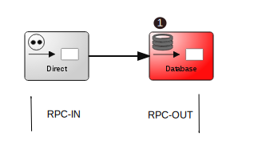
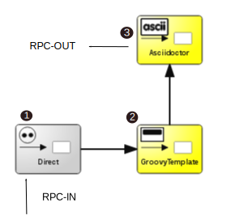

:linkattrs:
:source-highlighter: rouge

=== icon:play[size=1x,role=black] Verarbeitungschritte ===

==== Serverseitig ====
--
[role=border]

--
<1> Die Featureliste aus Datenbank abfragen +
Antwort auf *<simpl-executeFilter>*

{empty} +

[role=border]

<1> Der Adapter zum System, Eingang des RPC-Calls
<2> Ersetzen von Variablen,  hier der Produkt- Imagename, Preis und EAN.
<3> Produktbeschreibung nach HTML wandeln und in RPC-Out speichern. +
Antwort auf *<simpl-asciidoctor>*

{empty} +

==== Clientseitig(Darstellung) ====

[source,handlebars,linenums]
----

	<!--1-->
	<simpl-executeFilter pageSize=10 offset=0 data="{{featureList}}" namespace="firstapp" name="feature.filter" params="{lang:'de'}"></simpl-executeFilter>
	<simpl-carousel items="{{featureList}}" flex style="overflow:hidden;opacity:0.99;height: 100%;"><!--2-->
		<template repeat="{{feature,i in featureList}}"><!--3-->
			<simpl-panel data-index="{{i}}" bgcolor="#EAEAEA" fontWeight="bold" fontSize="1.0em" color="black" heading="{{feature.headline}}" collapsable="false" collapsed="false">
				<simpl-asciidoctor data-index="{{i}}" data="{{feature}}"><!--4-->

{empty} +
[grid=none,frame=none,cols="33a,66a"]
|===
| image::$picture[Picture,height=165,align=left] | $description
|===
				</simpl-asciidoctor>
			</simpl-panel>
		</template>
	</simpl-carousel>

----

<1> Ausführen des Filter,liefert die Featureliste
<2> Das Carousel erstellen
<3> und mit den Features füllen
<4> Die Featurebeschreibung mit Asciidoctor erstellt
